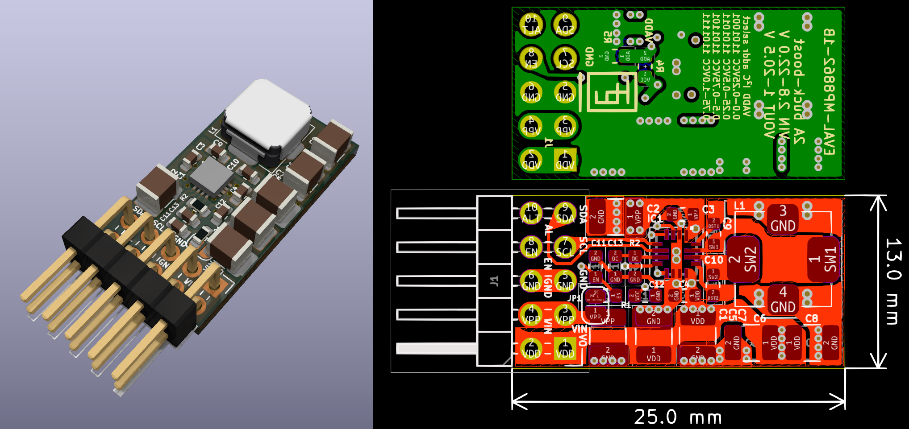
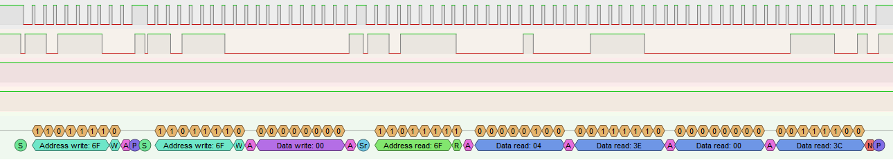
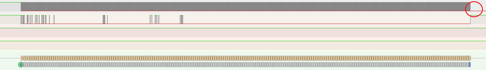
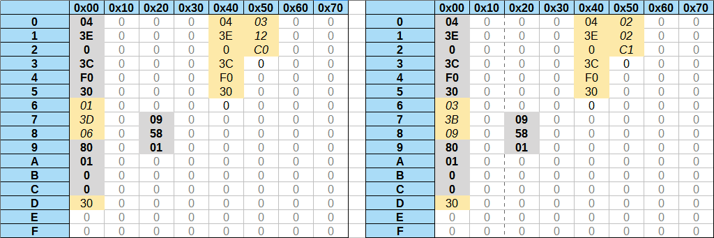
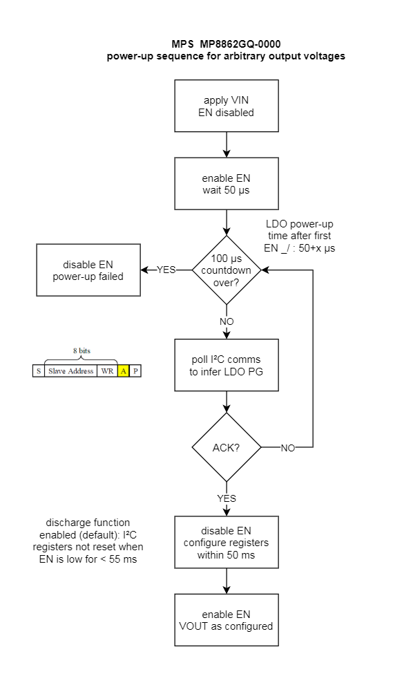

# EVAL-MP8862: I²C-controlled 1 .. 20.47 V / 2 A buck-boost module

EVAL-MP8862 is a compact and self-contained DCDC module for 2.8 .. 22 V in to 1 .. 20.47 V output conversion. It is designed to leverage the features provided by [MP8862GQ-0000](https://www.monolithicpower.com/en/mp8862.html) to provide digital control over the output voltage (10 mV steps) and current limit (50 mA steps or depending on resistor programming).

In its compact 13x25 mm² form factor with 2.54 mm (0.1") pitch pin header, EVAL-MP8862 can be used for evaluation on the breadboard as well as in application circuits. 

The project is created using a nightly build of [KiCad](https://kicad-pcb.org/), and the board files should be supported by KiCad v6 and higher.

**Features**

- 1 .. 20.47 V / 2 A output with optional line drop compensation
- synchronous 4 switch topology with constant on-time / off-time control (buck-/boost-mode)
- I²C interface to adjust voltage in 10 mV steps / current limit in 50 mA steps
- 4 resistor-programmed I²C addresses for bus control of multiple converter modules
- digital CC/CV mode readout
- digital output enable / disable 
- on-board ceramic input and output capacitors
- reduced radiated EMI design with magnetically and electrically shielded power inductor
- 1x05 pin header option for I²C and power 
- 2x05 pin header for full feature set (adds EN enable/!powerdown and ALT alert output)
- factory programming of the default behavior set on EN rising edge

**Caveat**

EVAL-MP8862 can immediately be used for applications that require >= 5.0 V output. A configuration sequence is described below to use the board for lower voltages while respecting maximum output voltage limits. See *One-Time Programmable* below for more details.

## Schematic

## Control Interface

Communication via I²C is described in the [MP8862 datasheet](https://www.monolithicpower.com/en/documentview/productdocument/index/version/2/document_type/Datasheet/lang/en/sku/MP8862/document_id/3999/) ([cached version](doc/MP8862.pdf)).

I²C device addresses can be resistor-programmed with generous tolerance.

I²C communication follows a common [I²C frame structure](img/MP8862_I2C_transfers.PNG) with single and multi-register write, and (officially) single-register read operations. See more below.

The 11 bit voltage setpoint and 7 bit current limit values are configured via VOUT\_H:VOUT\_L and IOUT\_LIM registers. 

Default values can only be set at the factory. The defaults for the marketed -0000 variant are given below. Note in particular that "Output Voltage Discharge Mode" is "Enabled", which ensures a > 50 ms sustain time after EN is pulled low, during which powerdown is not entered and the register contents can be read and written.

### I2C multi-byte reads

"page 23" (no figure number or caption given) shows a single-byte read operation. Since NACK is issued by the bus master, one could test how the device responds to ACK and continued reading of the form:

    S
    deviceAddress << 1 | 0 : ACK : REG_ADDR_K : ACK
    Sr
    deviceAddress << 1 | 1 : ACK : BYTE K [: ACK : BYTE K+1 [ : ... ]] : NACK
    P

Indeed, it turns out that  reading multiple bytes in series is legitimate. The PulseView capture + decoding shows four bytes read, starting at address 0x00:

How far can this be taken? Reading 256 or more bytes:

Several observations can be made: 
1. Reading past ranges of documented registers is allowed.
2. An arbitrary number of bytes can be read.
3. There are non-zero registers outside the documented range of registers.
4. The register counter does not seem to wrap around, even when reading 128 or more bytes.

Here are the register contents after power-up into normal operation with Enable pulled high:

The documented registers are shown on gray background. Some registers which have an actual purpose may read as zero and cannot be recognized as such, and may be read-only, so write-readback tests may fail to expose them.

Testing another chip, the 0x40..0x4F block seems to be identical and probably contains OTP defaults for the registers. The 0x50..0x5F block however contains differing values:

	0x50 : 02 02 C1 00 00 ..
 
One possible explanation is that we are looking at the MP8862 internal calibration coefficients here. MPS determines these in-house for each chip. There is reason to believe that the OTP memory is not divided up into banks for factory calibration and power-up defaults, giving rise to the inconvenience that customers cannot set power-up defaults during their own manufacturing process.

When reading 255 or more bytes, [something bad happens](img/read_0x00_0xFF_uart_starts_out_of_order_STM32F7_potential_problem.PNG) at the end (out-of-order execution of a subsequent UART transmission, NACK and STOP are missing) but probably the STM32F7 I2C master used for testing is to blame in this case.

**To conclude this side quest**, reading multiple consecutive register addresses is proven to work, and (some) defaults seem to be readable. The addresses are not guaranteed and may change with later revisions, but Device ID and IC Revision should make this traceable. The read sequence format is described above, following a regular memory read pattern.

## Power-Up Sequence

EVAL-MP8862-1B has a solder jumper JP1 that ships in an open configuration. The device then defaults to 2 Meg pulldown and stays in powerdown. (The PCB assembly should not be operated in conditions with condensing humidity and surface contamination.)

Regular operation foresees that EN is either pulled up or actively driven by a microcontroller or the output of a digital isolator.

 
The following section describes a workaround that should allow full control over the module output voltage while using the commercially available MP8862GQ-0000 chip variant.

Hypothesis:

- EN rising edge enables the internal 3.65 V LDO
- internal LDO charges the external 1 µF capacitor within 50-100 µs
- the internal LDO has an internal powergood signal (let's call it LDO.PG)
- LDO.PG enables the I²C peripheral
- LDO.PG enables soft-start charging and power output
- soft-start is sufficiently slow to permit several I²C bytes at < 3400 kHz before the output voltage rises above 1.0V
- Once the device ACKs after a start condition and device address match, EN can be turned off again
- after disabling EN again, the chip stays active for at least 50 ms during which CTL1.EN can be cleared
- device can be safely shut down when a timeout is encountered

The sequence is visualized in the chart below. See the datasheet for statements that support some of the points.

We'd need to decap and investigate one of those chips to see how they're put together, but in the discussion with an MPS FAE we concluded that assuming the I²C peripheral is deterministic in its ACK behavior, this routine should work and unlock the full usability of the MP8862.

I personally remain hopeful that Monolithic Power Systems consider providing another variant that defaults to CTL1.EN = 0 to enable reliable I²C-based control in a stock product, making this workaround obsolete. 

## "One-Time Programmable"

EVAL-MP8862 is built around the MP8862GQ-0000. The default configuration (0000) of this chip is such that when enabling, the output rises to +5.0 V. The output can be disabled and the voltage setpoint can be configured by setting the appropriate register values. When pulling the EN pin low, MP8862 enters powerdown. When the chip is re-enabled, default register settings are restored, and with them "output ON" and "5.0 V". 

A general purpose digitally controlled variant that defaults to "output disabled on power-up" can be procured upon request only. The FAEs I contacted thankfully responded quickly and were able to provide some insights. The biggest catch is that the term "one-time programmable" used in the datasheet actually is a misnomer: configuration bits are written into OTP memory at the factory, along with timming bits. This ties the behavior configuration to the factory calibration and does not allow the designer to set up the chip via I²C during PCB production. Unfortunately I only realized this when it was too late to scrap the design, as I had assumed that the programming sequence can be obtained by contacting MPS, and then one would be good to go.

In terms of prototyping and small-scale production however, use of a MP8862 variant that has its output disabled on power-up remains hamstringed by limitations introduced by "customization" (RFQ for 100 pc. was irrelevant, so assuming 1-3k MOQ and 6-10 week factory lead time).

It would be greatly appreciated if MPS provided a default-output-off version for purely I²C-based control through distributors like Mouser, but this requires some momentum and popularity to even be economically relevant.

## Revision History

- Revision 1B: 0.4 mm via-in-pad construction changed to 0.3 mm via-in-pad connections, solder jumper JP1 added to detach EN pull-up (fallback to internal 2 Meg pull-down so the DCDC converter stays in powerdown until enabled explicitly via EN high.
- Revision 1A: 11 PCBs assembled with 4.7 µH, 6.8 µH inductors and different numbers of input and output capacitors for noise and stability testing. 

---

**Corrections and Improvements**

Feedback is always welcome.

**Legal Disclaimer**

Excerpts of technical documentation published by the manufacturer (MPS) are reproduced here for the purposes of accurate representation of device properties and technical discussion.

PCB design license: [Creative Commons - Attribution - ShareAlike 3.0](http://creativecommons.org/licenses/by-sa/3.0/)

All files are provided as-is. Physical realization of any circuit requires design review and appropriate selection of components. No responsibilities for damage or harm caused by use of material presented herein will be accepted.
